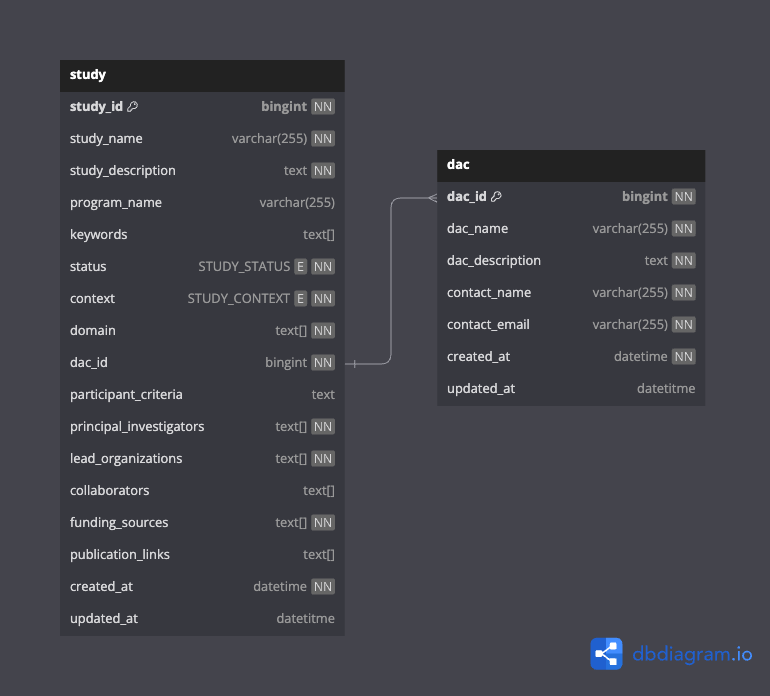

# PCGL Clinical Submission Data Model

## Entities

> [!NOTE]
> This README _only_ describes the data model which is specifically used by the PCGL data model in Clinical Submission.
>
> For information on other tables within the Clinical Submission process, please take a look at the [Lyric](https://github.com/overture-stack/lyric) repository in the [Overture Stack](https://www.overture.bio/), the product Clinical Submission is based upon.

### Study

A PCGL study is represented by this table, it contains an anonymized unique study ID by which the study is identified, the study name, its description, keywords, status, the context in-which it was conducted, etc...

### DAC

Each study is reliant to being assigned to a DAC (Data Access Committee). As such each study has a Foreign Key requirement to a DAC ID. The DAC table contains all information related to DACs and DAC Members.
